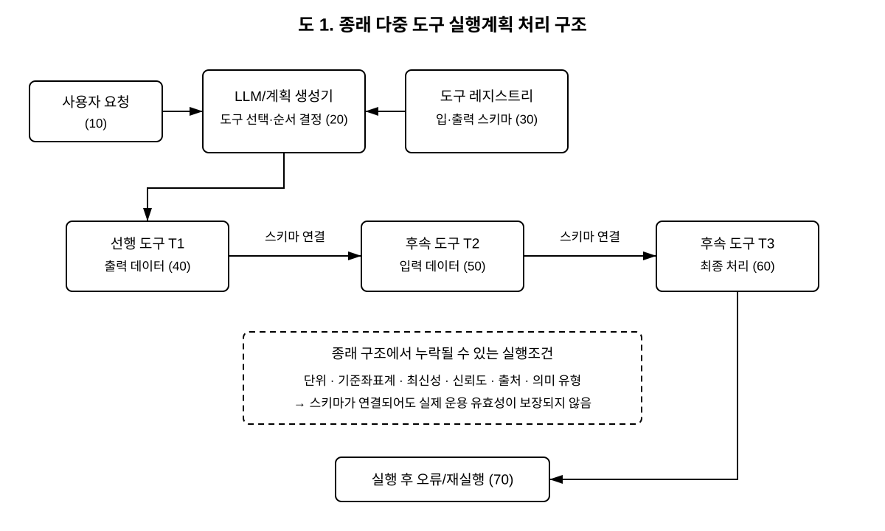
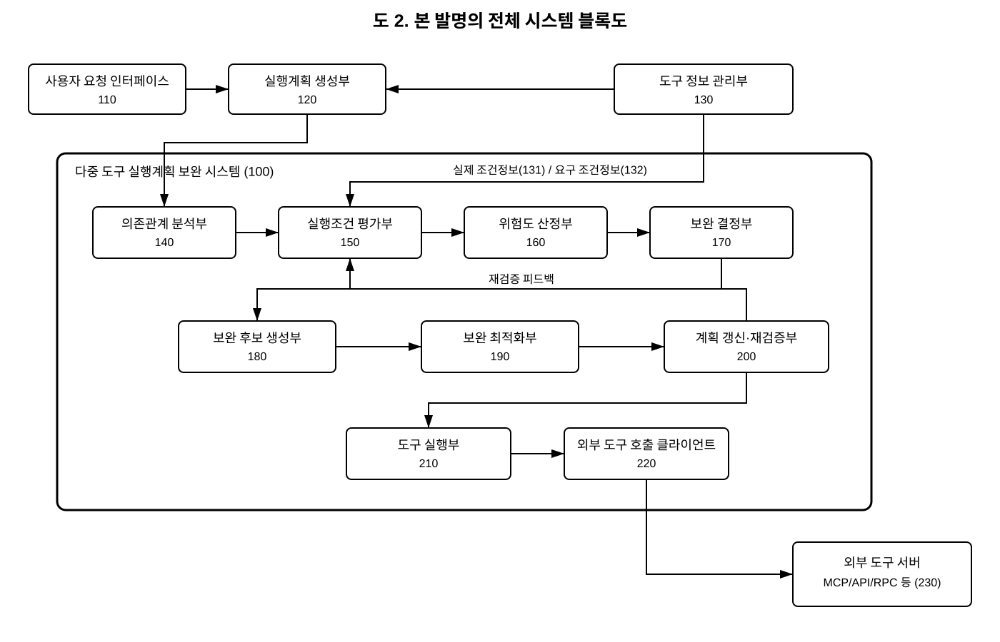
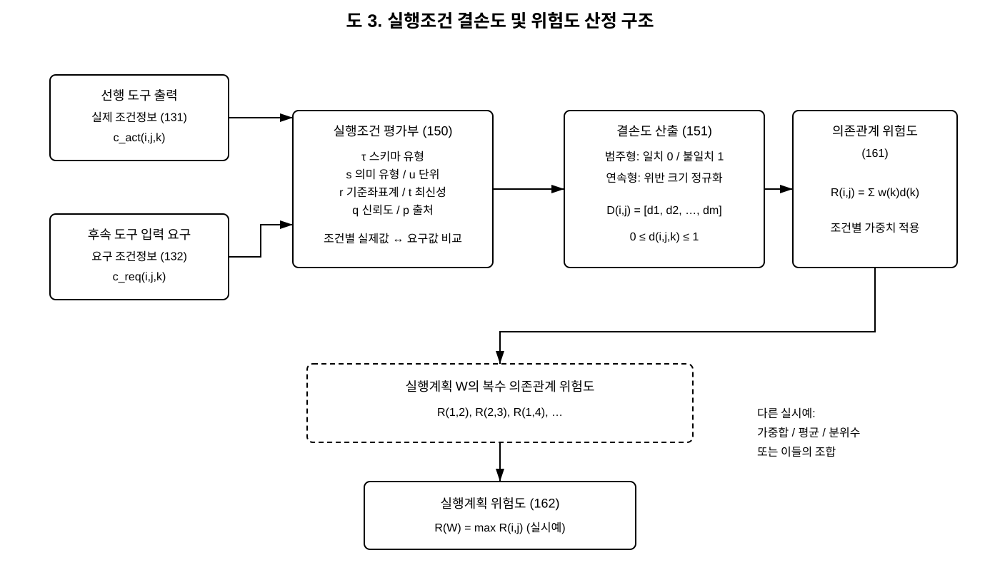
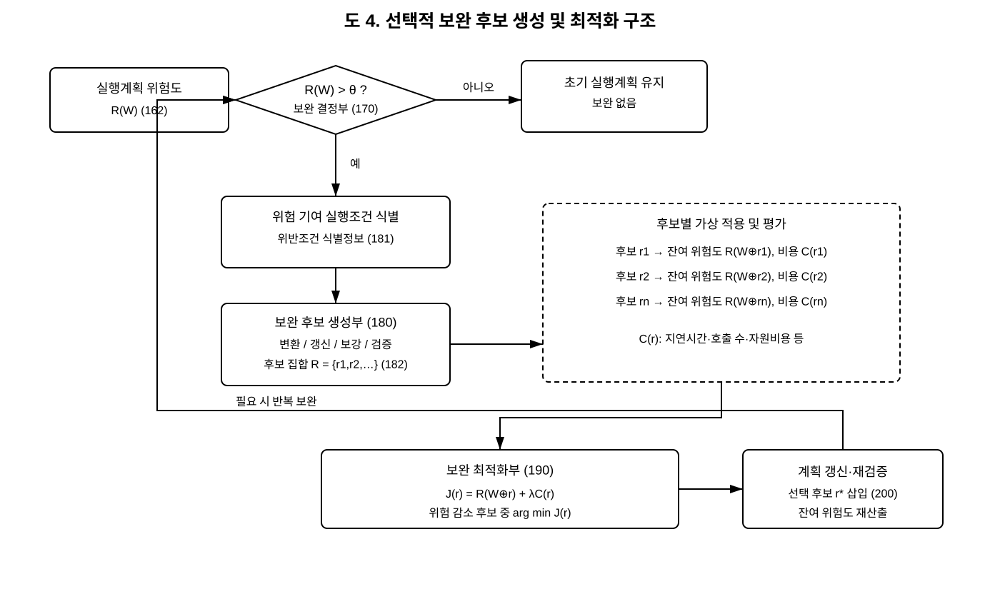
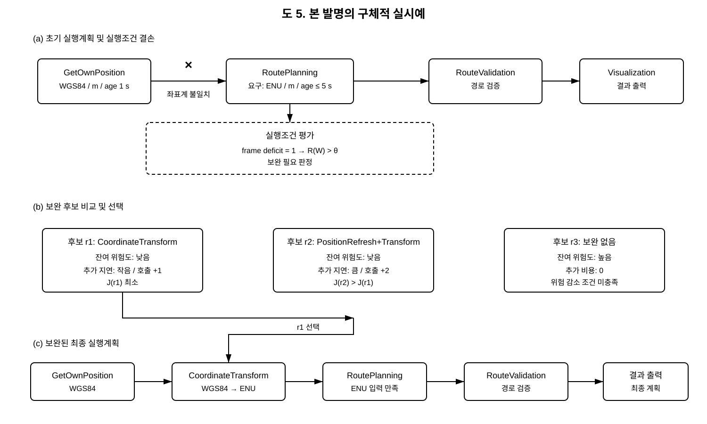
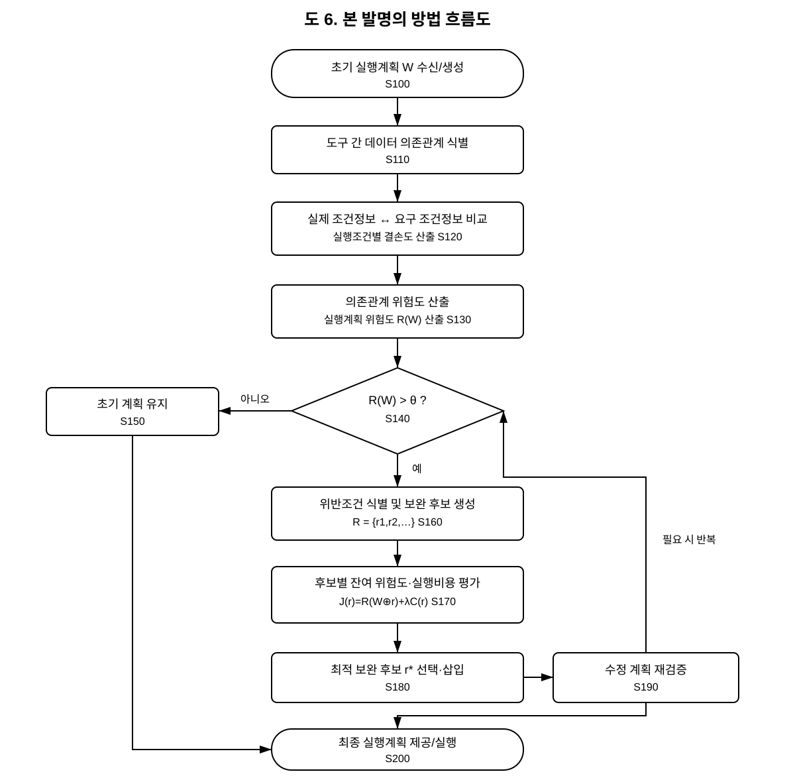
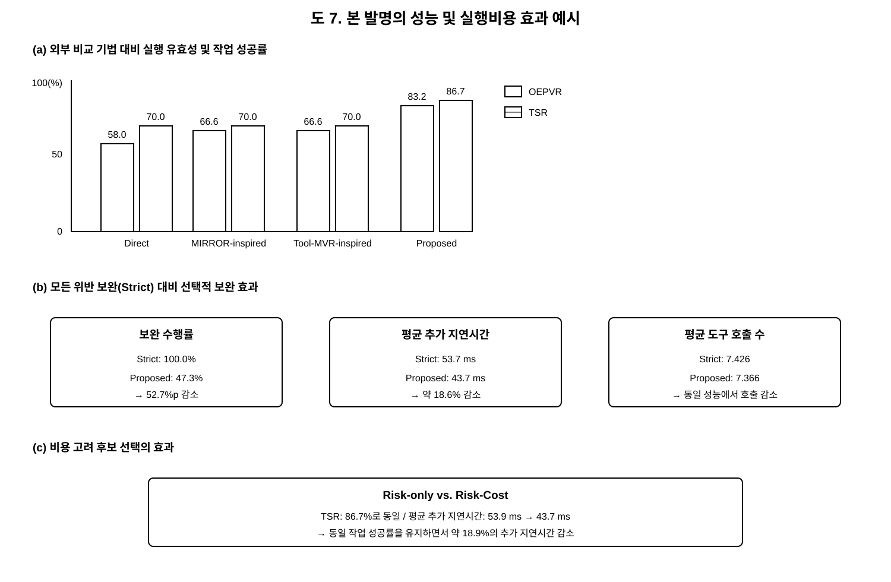

# 4. 도면

## 대표도

**대표도: 도 2. 본 발명의 전체 시스템 블록도**

도 2는 본 발명의 핵심 특징인 **다중 도구 실행계획의 의존관계 분석 → 실행조건 평가 → 위험도 산정 → 선택적 보완 판단 → 보완 후보 생성 및 비용 기반 최적화 → 실행계획 재검증 → 도구 실행**의 전체 구성을 하나의 도면에서 가장 잘 나타내므로 대표도로 선정한다.

대표도 및 이하 도면에서 사용하는 발명의 구성요소 부호는 「2. 나. 본 발명의 도면을 이용한 구체적인 설명」 및 `도면부호.md`에서 사용하는 부호와 동일하게 적용한다.

---

## 도 1. 종래 다중 도구 실행계획 처리 구조

**도면 설명:** 도 1은 사용자 요청에 따라 실행계획 생성기가 도구 레지스트리의 입·출력 스키마를 이용하여 복수의 외부 도구를 연결하고 실행하는 종래의 다중 도구 실행계획 처리 구조를 나타낸다. 종래 구조에서는 스키마가 연결되더라도 단위, 기준좌표계, 최신성, 신뢰도 및 출처와 같은 실행조건을 별도로 평가하지 않아 실행 후 오류 또는 재실행이 발생할 수 있음을 나타낸다.

> 도 1은 종래기술 설명용 도면으로서, 본 발명의 구성요소 부호(100~230)와 구분하기 위하여 종래기술 설명용 부호를 사용한다.

---

## 도 2. 본 발명의 전체 시스템 블록도 — **대표도**

**도면 설명:** 도 2는 본 발명에 따른 다중 도구 실행계획 보완 시스템(100)의 전체 구성을 나타낸다. 시스템(100)은 사용자 요청 인터페이스(110), 실행계획 생성부(120), 도구 정보 관리부(130), 의존관계 분석부(140), 실행조건 평가부(150), 위험도 산정부(160), 보완 결정부(170), 보완 후보 생성부(180), 보완 최적화부(190), 실행계획 갱신 및 재검증부(200), 도구 실행부(210), 외부 도구 호출 클라이언트(220) 및 외부 도구 서버(230)를 포함할 수 있다. 도구 정보 관리부(130)는 실제 조건정보(131) 및 요구 조건정보(132)를 실행조건 평가에 제공할 수 있다.

---

## 도 3. 실행조건 결손도 및 위험도 산정 구조

**도면 설명:** 도 3은 실행조건 평가부(150)가 선행 도구 출력의 실제 조건정보(131)와 후속 도구의 요구 조건정보(132)를 비교하여 실행조건 결손도 벡터(151)를 산출하고, 위험도 산정부(160)가 상기 결손도에 기초하여 의존관계 위험도(161) 및 실행계획 위험도(162)를 산출하는 구조를 나타낸다. 실행조건은 스키마 유형, 의미 유형, 단위, 기준좌표계, 최신성, 신뢰도 및 출처 중 적어도 둘 이상을 포함할 수 있다.

---

## 도 4. 선택적 보완 후보 생성 및 최적화 구조

**도면 설명:** 도 4는 보완 결정부(170)가 실행계획 위험도(162)를 위험도 기준값과 비교하여 보완 필요 여부를 판단하고, 보완이 필요한 경우 보완 후보 생성부(180)가 위반조건 식별정보(181)에 기초하여 보완 후보 집합(182)을 생성하며, 보완 최적화부(190)가 각 후보의 잔여 위험도(191), 실행비용(192) 및 후보 목적값(193)을 이용하여 최종 보완 후보를 선택하는 과정을 나타낸다. 선택된 후보는 실행계획 갱신 및 재검증부(200)에 의해 실행계획에 반영되고 재검증된다.

---

## 도 5. 본 발명의 구체적 실시예

**도면 설명:** 도 5는 선행 위치 획득 도구의 출력 데이터가 후속 경로계획 도구와 스키마상 연결 가능하지만 기준좌표계가 서로 다른 경우를 예시한다. 실행조건 평가 결과 계획 위험도가 기준값을 초과하면 좌표변환 도구 등을 보완 후보로 생성하고, 보완 후 잔여 위험도와 추가 지연시간 또는 호출 수를 비교하여 적합한 보완 후보를 선택한 뒤, 보완된 실행계획을 후속 도구에 제공하는 실시예를 나타낸다.

---

## 도 6. 본 발명의 방법 흐름도

**도면 설명:** 도 6은 초기 실행계획을 수신 또는 생성하는 단계(S100), 도구 간 데이터 의존관계를 식별하는 단계(S110), 실행조건별 결손도를 산출하는 단계(S120), 의존관계 및 실행계획 위험도를 산출하는 단계(S130), 위험도 기준값과 비교하여 보완 필요 여부를 판단하는 단계(S140), 보완 후보를 생성하는 단계(S160), 후보별 잔여 위험도 및 실행비용을 평가하는 단계(S170), 최적 보완 후보를 선택·삽입하는 단계(S180), 수정된 실행계획을 재검증하는 단계(S190), 및 최종 실행계획을 제공 또는 실행하는 단계(S200)를 나타낸다.

---

## 도 7. 본 발명의 성능 및 실행비용 효과 예시

**도면 설명:** 도 7은 본 발명의 구현예에서 확인된 성능 및 실행비용 효과를 나타내는 보조 도면이다. 외부 비교 기법 대비 운용 실행계획 유효성(OEPVR) 및 작업 성공률(TSR)의 향상, 모든 실행조건 위반을 보완하는 Strict 방식 대비 선택적 보완에 따른 보완 수행률 및 추가 지연시간 감소, 그리고 위험도만 고려한 후보 선택 대비 위험도와 비용을 함께 고려한 후보 선택의 추가 지연시간 감소를 예시한다. 도 7의 수치는 특정 구현예에 대한 실험결과이며 발명의 권리범위를 해당 수치에 한정하지 않는다.

---

# 도면부호 일치 기준

본 발명의 구체적 설명 및 도 2 내지 도 4에서 사용하는 주요 부호는 다음과 같이 일치시킨다.

| 부호 | 구성요소 |
|---:|---|
| 100 | 다중 도구 실행계획 보완 시스템 |
| 110 | 사용자 요청 인터페이스 |
| 120 | 실행계획 생성부 |
| 130 | 도구 정보 관리부 |
| 131 | 실제 조건정보 |
| 132 | 요구 조건정보 |
| 140 | 의존관계 분석부 |
| 150 | 실행조건 평가부 |
| 151 | 실행조건 결손도 벡터 |
| 160 | 위험도 산정부 |
| 161 | 의존관계 위험도 |
| 162 | 실행계획 위험도 |
| 170 | 보완 결정부 |
| 180 | 보완 후보 생성부 |
| 181 | 위반조건 식별정보 |
| 182 | 보완 후보 집합 |
| 190 | 보완 최적화부 |
| 191 | 잔여 위험도 |
| 192 | 실행비용 |
| 193 | 후보 목적값 |
| 200 | 실행계획 갱신 및 재검증부 |
| 210 | 도구 실행부 |
| 220 | 외부 도구 호출 클라이언트 |
| 230 | 외부 도구 서버 |

## 제출 시 사용 원칙

- **대표도는 도 2**로 지정한다.
- 발명의 구체적 설명에서 `실행조건 평가부(150)`라고 기재한 경우 도면에서도 동일하게 `150`을 사용한다.
- 동일 구성요소에 도면마다 다른 번호를 부여하지 않는다.
- 도 1은 종래기술 도면이므로 본 발명 고유 부호와 구분하여 사용한다.
- 도 7은 효과를 설명하기 위한 보조도이며 대표도가 아니다.
- 회사 양식에 이미지를 직접 삽입하는 경우 **각 이미지 바로 아래에 본 파일의 “도면 설명” 문장을 함께 배치**한다.
